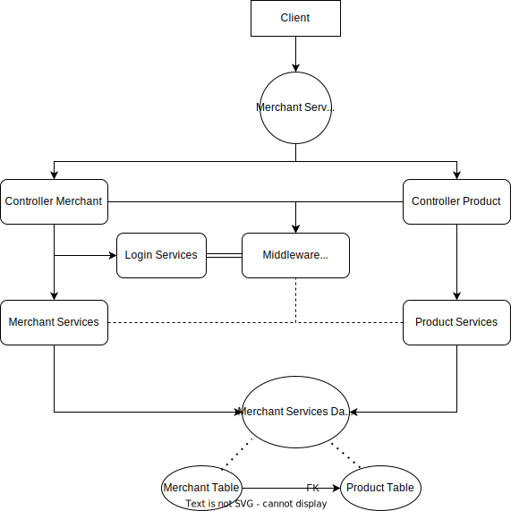
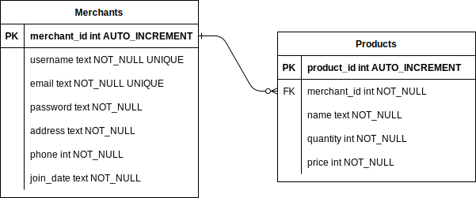

##Simple Architecture Diagram of this API Project

----
##Entity Relationship Diagram of this API Project


##API-CONTRACT

#Merchants
* Merchant User object (merchant_user_object)
```
{
  id: integer (primary key) (foreign key) (auto-increment)
  username: string (unique)
  email: string (unique)
  password: string 
  address: string
  phone: integer
  join_date: datetime(ISO 8601) (defaults to current time) (auto-generated)
}
```

**GET /merchant/id/:id**
----
  Returns the specified merchant user by id.
* **URL Params**  
  *Required:* `id=[integer]`
* **Data Params**  
  None
* **Headers**  
  Content-Type: application/json  
* **Success Response:** 
* **Code:** 200  
  **Content:**  `{merchant_user_object}` 
* **Error Response:**  
  * **Code:** 404  
  **Content:** `{ error : "merchant not found" }`  

**GET /merchant/name/:name**
----
  Returns the specified merchant user by name.
* **URL Params**  
  *Required:* `name=[string]`
* **Data Params**  
  None
* **Headers**  
  Content-Type: application/json  
* **Success Response:** 
* **Code:** 200  
  **Content:**  `{merchant_user_object}` 
* **Error Response:**  
  * **Code:** 404  
  **Content:** `{ error : "merchant not found" }`

**GET /merchant/admin**
----
  Returns all merchant users in the system (admin only).
* **URL Params**  
  None
* **Data Params**  
  {
    username: string("admin")
    password: string("admin")
  }
* **Headers**  
  Content-Type: application/json  
* **Success Response:** 
* **Code:** 200  
  **Content:**
```
{
  merchants :[
        {merchant_user_object},
        {merchant_user_object},
        {merchant_user_object},
        ...
        {merchant_user_object}
      ] 
}
```
* **Error Response:**  
    * **Code:** 401  
  **Content:** `{ error : "you are not an admin" }`
  OR
  * **Code:** 404  
  **Content:** `{ error : "merchant not found" }`

**GET /merchant/admin/products**
----
  Returns all merchant users and their products in the system by using inner join in database (admin only).
* **URL Params**  
  None
* **Data Params**  
  {
    username: string("admin")
    password: string("admin")
  }
* **Headers**  
  Content-Type: application/json  
* **Success Response:** 
* **Code:** 200  
  **Content:**
```
{ merchants_products :[
        {merchant_user_object & product_object},
        {merchant_user_object & product_object},
        {merchant_user_object & product_object},
        ...
        {merchant_user_object & product_object}
      ]
}
```
* **Error Response:**  
    * **Code:** 401  
  **Content:** `{ error : "you are not an admin" }`
  OR
  * **Code:** 404  
  **Content:** `{ error : "data not found" }`

**POST /merchant**
----
 Create merchant user into the system and return the new object.
* **URL Params**  
  None
* **Data Params**  
```
{
  merchants: [
    {
      username: string
      email: string
      password: string
      address: string
      phone: integer
    }
  ]
}
```
* **Headers**  
  Content-Type: application/json  
* **Success Response:**  
* **Code:** 201  
  **Content:** `{merchant_user_object}`
* **Error Response:**
  * **Code:** 400  
  **Content:** `{ error : "merchant name already used" }`
  OR
  * **Code:** 400  
  **Content:** `{ error : "merchant email already used" }`

**POST /merchants/login**
----
  Login to system and return the web token to access.
* **URL Params**  
  None
* **Headers**  
  Content-Type: application/json  
* **Data Params**  
```
  {
    username: string or email: string
    password: string
  }
```
* **Success Response:**  
* **Code:** 200  
  **Content:**  `{ web_token }` 
* **Error Response:**
  * **Code:** 401  
  **Content:** `{ error : "username or email does not exist!" }` 
  OR
  * **Code:** 401
  **Content:** `{ error : "password is incorrect!" }`

**PUT /merchant/id/:id**
----
  Update the specified merchant user by id.
* **URL Params**
  *Required:* `id=[integer]`
* **Data Params**
```
{
  username: string
  email: string
  password: string
  address: string
  phone: integer
}
```
* **Headers**  
  Content-Type: application/json
  Authorization: Bearer {web_token}
* **Success Response:**
* **Code:** 200  
  **Content:** `{merchant_user_object}`
* **Error Response:**
  * **Code:** 401  
  **Content:** `{ error : "unauthorized" }`
  OR
  * **Code:** 400
  **Content:** `{ error : "merchant not found" }`

**PUT /merchant/name/:name**
----
  Update the specified merchant user by name.
* **URL Params**
  *Required:* `name=[string]`
* **Data Params**
```
{
  username: string
  email: string
  password: string
  address: string
  phone: integer
}
```
* **Headers**  
  Content-Type: application/json
  Authorization: Bearer {web_token}
* **Success Response:**
* **Code:** 200  
  **Content:** `{merchant_user_object}`
* **Error Response:**
  * **Code:** 401  
  **Content:** `{ error : "unauthorized" }`
  OR
  * **Code:** 400
  **Content:** `{ error : "merchant not found" }`

**DELETE /merchant/id/:id**
----
  Deletes the specified user by id.
* **URL Params**  
  *Required:* `id=[integer]`
* **Data Params**  
  None
* **Headers**  
  Content-Type: application/json  
  Authorization: Bearer {web_token}
* **Success Response:** 
  * **Code:** 204 
  **Content:** `{merchant user deleted}`
* **Error Response:**  
  * **Code:** 401
  **Content:** `{ error : "unauthorized" }`
  OR
  * **Code:** 400
  **Content:** `{ error : "merchant not found" }`

**DELETE /merchant/name/:name**
----
  Deletes the specified user by name.
* **URL Params**  
  *Required:* `name=[string]`
* **Data Params**  
  None
* **Headers**  
  Content-Type: application/json  
  Authorization: Bearer {web_token}
* **Success Response:** 
  * **Code:** 204 
  **Content:** `{merchant user deleted}`
* **Error Response:**  
  * **Code:** 401
  **Content:** `{ error : "unauthorized" }`
  OR
  * **Code:** 400
  **Content:** `{ error : "merchant not found" }`

#Products

* Product object (product_object)
```
{
  id: integer (primary key) (auto-increment)
  merchant_id: integer (foreign key to merchant_user_object.id)
  name: string
  quantity: integer
  price: integer
}
```

**GET /merchant/id/:id/products**
----
  Returns all products in the specified merchant.
* **URL Params**  
  *Required:* `id=[integer]`
* **Data Params**  
  None
* **Headers**  
  Content-Type: application/json  
* **Success Response:** 
* **Code:** 200  
  **Content:**  
```
{
  products: [
          {<product_object>},
          {<product_object>},
          ...
          {<product_object>}
         ]
}
``` 
* **Error Response:**  
  * **Code:** 400
  **Content:** `{ error : "produtcs not found" }`

**GET /merchants/id/:id/products/:productId**
----
  Returns the specified product by id in the specified merchant.
* **URL Params**  
  *Required:* `id=[integer]` & `productId=[integer]`
* **Data Params**  
  None
* **Headers**  
  Content-Type: application/json
* **Success Response:**  
* **Code:** 200  
  **Content:**  `{ <product_object> }` 
* **Error Response:**  
  * **Code:** 404  
  **Content:** `{ error : "product not found" }`  

**GET /merchants/id/:id/products/name/:productName**
----
  Returns the specified product by name in the specified merchant.
* **URL Params**  
  *Required:* `id=[integer]` & `productName=[string]`
* **Data Params**  
  None
* **Headers**  
  Content-Type: application/json
* **Success Response:**  
* **Code:** 200  
  **Content:**  `{ <product_object> }` 
* **Error Response:**  
  * **Code:** 404  
  **Content:** `{ error : "product not found" }`  

**POST /merchants/id/:id/products**
----
  Creates a new Product in the specified merchant and returns the new object.
* **URL Params**  
  *Required:* `id=[integer]`
* **Data Params**  
```
  {
    name: string
    quantity: integer
    price: integer
  }
```
* **Headers**  
  Content-Type: application/json
  Authorization: Bearer {web_token}  
* **Success Response:**  
* **Code:** 201 
  **Content:**  `{ <product_object> }` 
* **Error Response:**
  * **Code:** 401
  **Content:** `{ error : "unauthorized" }`
  OR
  * **Code:** 404
  **Content:** `{ error : "product not created" }`

**PUT /merchants/id/:id/products/:productId**
----
  Updates fields on the specified product by id in the specified merchant and returns the updated object.

* **URL Params**  
  *Required:* `id=[integer]` & `productId=[integer]`
* **Data Params**  
```
  {
  	name: string
    quantity: integer
    price: integer
  }
```
* **Headers**  
  Content-Type: application/json  
  Authorization: Bearer {web_token}
* **Success Response:** 
* **Code:** 200  
  **Content:**  `{ <product_object> }`  
* **Error Response:**  
  * **Code:** 401
  **Content:** `{ error : "unauthorized" }`
  OR  
  * **Code:** 404
  **Content:** `{ error : "product not found" }`

**PUT /merchants/id/:id/products/name/:productName**
----
  Updates fields on the specified product by product name in the specified merchant and returns the updated object.

* **URL Params**  
  *Required:* `id=[integer]` & `productName=[string]`
* **Data Params**  
```
  {
  	name: string
    quantity: integer
    price: integer
  }
```
* **Headers**  
  Content-Type: application/json  
  Authorization: Bearer {web_token}
* **Success Response:** 
* **Code:** 200  
  **Content:**  `{ <product_object> }`  
* **Error Response:**  
  * **Code:** 401
  **Content:** `{ error : "unauthorized" }`
  OR  
  * **Code:** 404
  **Content:** `{ error : "product not found" }`

**DELETE /merchants/id/:id/products/:productId**
----
  Deletes the specified product by id in the specified merchant.
* **URL Params**  
  *Required:* `id=[integer]` & `productId=[integer]`
* **Data Params**  
  None
* **Headers**  
  Content-Type: application/json  
  Authorization: Bearer {web_token}
* **Success Response:**  
  * **Code:** 204
  **Content:** `{product has been deleted}`
* **Error Response:**  
  * **Code:** 401
  **Content:** `{ error : "unauthorized" }`
  OR
  * **Code:** 404  
  **Content:** `{ error : "product not found" }`  

**DELETE /merchants/id/:id/products/name/:productName**
----
  Deletes the specified product by productName in the specified merchant.
* **URL Params**  
  *Required:* `id=[integer]` & `productName=[string]`
* **Data Params**  
  None
* **Headers**  
  Content-Type: application/json  
  Authorization: Bearer {web_token}
* **Success Response:**  
  * **Code:** 204
  **Content:** `{product has been deleted}`
* **Error Response:**  
  * **Code:** 401
  **Content:** `{ error : "unauthorized" }`
  OR
  * **Code:** 404  
  **Content:** `{ error : "product not found" }` 
